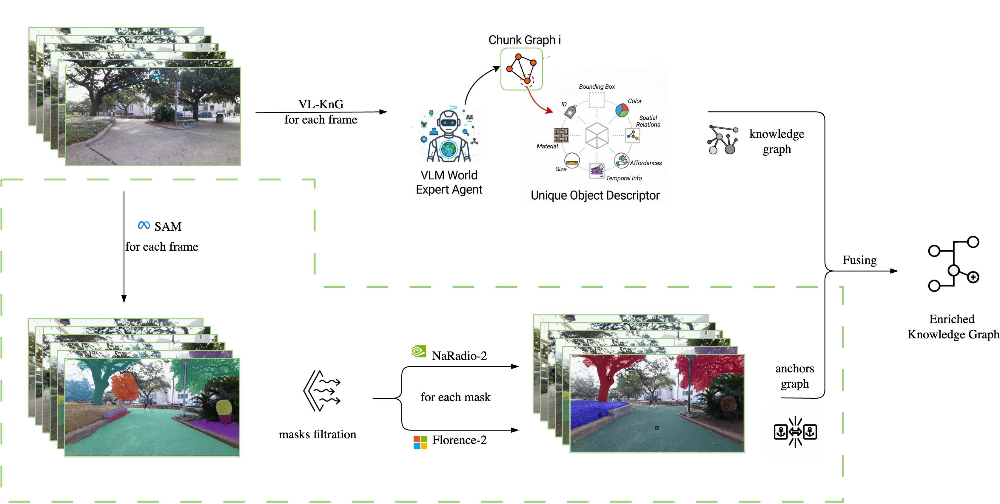

# AEGIS: Adaptive Environment Graph Identification System

<p align="center">
  
</p>

**Adaptive Environment Graph Hierarchies via Dynamic Anchor Selection**

> **Master's Thesis Project**  
> Denis Fatykhoph • Skoltech  
> Advisor: Prof. Gonzalo Ferrer

---

## Overview

AEGIS addresses the fundamental limitation of current hierarchical scene graph methods: their reliance on fixed, environment-specific schemas (e.g., floor→room→object). We propose a framework for **dynamic anchor object identification** that enables adaptive hierarchical knowledge graph construction across heterogeneous environments.

### Key Contributions

- **Dynamic Anchor Selection**: Three comparative strategies (VLM-based, frequency-based, visual clustering) for identifying organizational anchor objects
- **Adaptive Hierarchies**: Data-driven spatial organization that adapts to environment characteristics rather than imposing fixed schemas
- **Cross-Domain Generalization**: Framework operates across indoor and outdoor environments without manual reconfiguration
- **RGB-Only Processing**: Sufficient scene understanding using vision-language models and RGB observations

---

## Architecture

<p align="center">
  
</p>

Our pipeline integrates VL-KnG baseline for knowledge graph construction with visual feature extraction (SAM + RADIO-2 + Florence-2) to identify anchor objects and assemble adaptive hierarchies.

---

## Method

### Anchor Selection Strategies

1. **VLM-Based Selection**: Leverages vision-language models to reason about organizational importance through natural language prompts
2. **Frequency-Based Selection**: Statistical analysis treating persistent objects as stable organizational anchors
3. **Visual Feature Clustering**: Identifies anchors through unsupervised clustering in learned embedding space (RADIO)

### Adaptive Hierarchy Assembly

Once anchors are identified, we construct a three-level hierarchical knowledge graph:
- **Level 1**: Anchor nodes representing primary organizational structure
- **Level 2**: Associated objects with strong spatial/semantic relationships to anchors
- **Level 3**: Atomic objects instantiated when fine-grained detail is required

---

## Datasets

We evaluate on two complementary datasets:

- **[SCAND](https://www.cs.utexas.edu/~xiao/SCAND/)**: 8.7 hours, 138 trajectories of socially compliant navigation across indoor/outdoor environments
- **[EgoWalk](https://arxiv.org/abs/2505.21282)**: First-person city-walking videos with diverse outdoor navigation scenarios

---

## Benchmarks

Downstream task evaluation on:

- **[HM-EQA/Explore-EQA](https://github.com/Stanford-ILIAD/explore-eqa)**: 500 questions across 267 HM3D scenes for Embodied Question Answering
- **Task-driven object navigation**: Cross-environment navigation efficiency

---

## Research Hypotheses

**H1. Adaptive Hierarchy Superiority**: Dynamic anchor-based construction outperforms fixed schemas on downstream tasks

**H2. Cross-Domain Generalization**: Consistent performance across indoor and outdoor environments

**H3. RGB Sufficiency**: RGB + VLMs provide sufficient information for effective scene graphs, reducing hardware requirements

---

## Installation

```bash
# Clone repository
git clone https://github.com/your-username/AEGIS.git
cd AEGIS

# Create conda environment
uv venv --python 3.12 --prompt vizEnc
source .venv/bin/activate
uv sync

git clone git@github.com:facebookresearch/segment-anything.git
git clone git@github.com:RayFronts/RayFronts.git

# Install VL-KnG baseline
git clone https://github.com/VL-KnG/VL-KnG.git
cd VL-KnG && uv pip install -e .
```

---

## Quick Start

```python
from pathlib import Path
from PIL import Image
import numpy as np

# === 1. Initialize Models ===
from segmentation.sam import init_sam
from encoders.naradio import load_naradio_encoder
from encoders.florence import load_florence_model

project_dir = Path.cwd()
device = "cuda"

# SAM for segmentation
mask_generator = init_sam(project_dir, version='sam1', device=device)

# RADIO for visual embeddings
visual_encoder = load_naradio_encoder(project_dir, device=device)

# Florence-2 for object descriptions
florence_model, florence_processor = load_florence_model(device=device)

# === 2. Process Frames with vizEnc ===
from vizenc_utils.anchors import create_anchor_db, update_anchors
from vizenc_utils.matching import optimal_match_objects
from processing import process_masks_with_features, filter_masks

anchor_db = create_anchor_db()
frames = sorted(Path("data/your_scene/frames").glob("*.png"))

for frame_idx, frame_path in enumerate(frames):
    image = Image.open(frame_path).convert("RGB")
    masks = mask_generator.generate(np.array(image))
    masks = process_masks_with_features(image, masks, config, models)
    masks = filter_masks(masks, image.size, filter_config)
    update_anchors(anchor_db, frame_idx, masks, ...)

# === 3. Run vl-kgp for Semantic Graph ===
from vl_kgp.core.efficient_chunk_object_detection import EfficientChunkObjectDetector

detector = EfficientChunkObjectDetector(api_provider, chunk_size=8)
vlkgp_result = detector.detect_chunk(frame_paths)
# Returns: objects with descriptions + spatial_relationships

# === 4. Combine: Match Anchors with vl-kgp Objects ===
from vizenc_utils.matching import iou_match_objects
from vizenc_utils.bbox_utils import compute_iou

# Match by IoU + category similarity per frame
unified_objects = combine_results(anchor_db, vlkgp_result, config={
    'iou_weight': 0.6,
    'category_weight': 0.4,
    'score_threshold': 0.3
})

# Result: unified objects with both visual embeddings AND text descriptions
```

See `src/combination.ipynb` for the complete pipeline.

---

## Project Structure

```
AEGIS/
├── src/
│   ├── encoders/              # Visual encoders (DINOv2, RADIO, Florence-2)
│   ├── segmentation/          # SAM integration
│   ├── vizenc_utils/          # Anchor tracking, matching, visualization
│   │   ├── anchors.py         # Anchor database management
│   │   ├── matching.py        # IoU & embedding matching algorithms
│   │   ├── bbox_utils.py      # Bounding box utilities
│   │   └── visualization.py   # Mask & anchor visualization
│   ├── processing.py          # Feature extraction pipeline
│   ├── combination.ipynb      # Full vizEnc + vl-kgp pipeline
│   └── output/                # Exported unified chunks
├── vl-kgp/                    # VL-KnG baseline (submodule)
├── segment-anything/          # SAM (submodule)
├── RayFronts/                 # RADIO encoder (submodule)
├── data/                      # Input frames and datasets
└── configs/                   # Configuration files
```

---

## Results

### Preliminary Findings

- Visual features contribute **7-15%** of anchor objects, complementing VLM-based identification (63-85%)
- Stable anchor tracking across significant viewpoint changes in outdoor environments
- Multi-modal integration captures organizational structures missed by language-only approaches

Comprehensive evaluation results coming soon.

---

## Citation

```bibtex
@mastersthesis{fatykhoph2025AEGIS,
  title={Adaptive Environment Graph Hierarchies via Dynamic Anchor Selection},
  author={Fatykhoph, Denis},
  year={2025},
  school={Skolkovo Institute of Science and Technology},
  advisor={Ferrer, Gonzalo}
}
```

---

## Related Work

- **[HOV-SG](https://arxiv.org/abs/XXXX)**: Hierarchical Open-Vocabulary 3D Scene Graphs
- **[ConceptGraphs](https://arxiv.org/abs/2309.16650)**: Open-vocabulary 3D scene graphs
- **[VL-KnG](https://arxiv.org/abs/2510.01483)**: Visual Scene Understanding for Navigation Goal Identification

---

## Acknowledgments

This work is part of the "Semantic-integrated Segmentation and LiDAR Point Clouds for Traversability-Aware Graph Exploration" project at Skoltech's Center for Computational and Data-Intensive Science and Engineering (CDISE).

---

## License

This project is licensed under the MIT License - see the [LICENSE](LICENSE) file for details.

---

## Contact

Denis Fatykhoph - [denis.fatykhoph@skoltech.ru](mailto:denis.fatykhoph@skoltech.ru)

